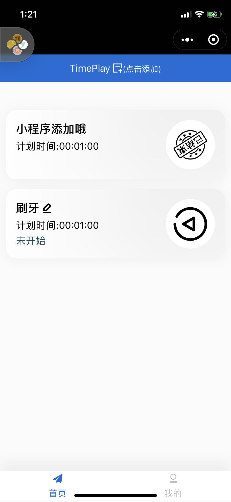
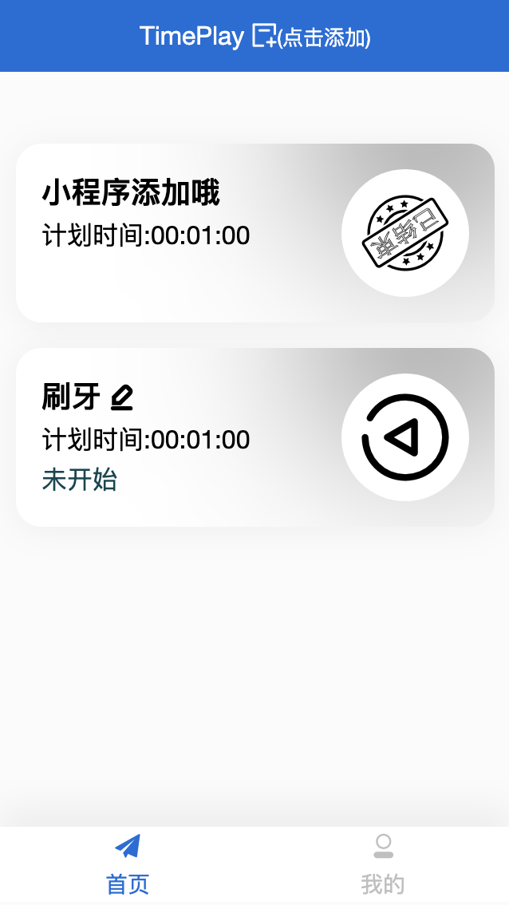
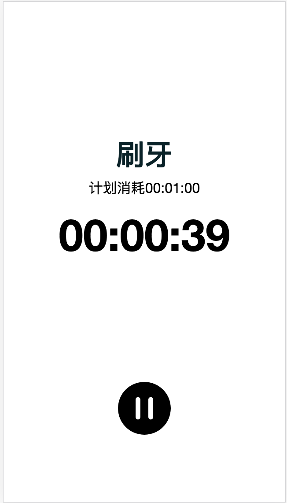
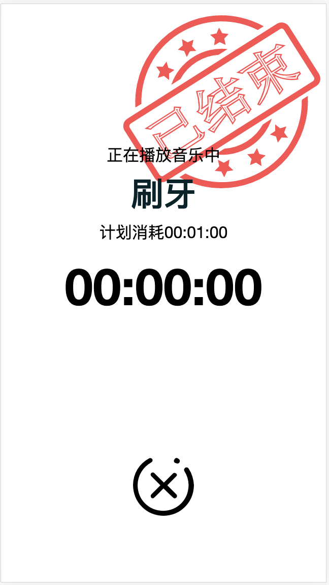

# PlayTime
时间管理工具

## 技术
koa + mysql + [kbone](https://wechat-miniprogram.github.io/kbone/docs/#%E4%BB%8B%E7%BB%8D) + [kbone-ui](https://wechat-miniprogram.github.io/kbone/docs/ui/intro/quickstart.html)

## npm 包
* validator 校验器

## 文件
layout 是前端页面
server 是后端接口

## sql
采用的是mysql8

其中里面账号admin 密码：123456*
服务端注册账号密码不能纯数字的，账号长度要6位数以上

## 部分页面情况

### 首页（小程序+web）

 

### 倒计时(web)

 

